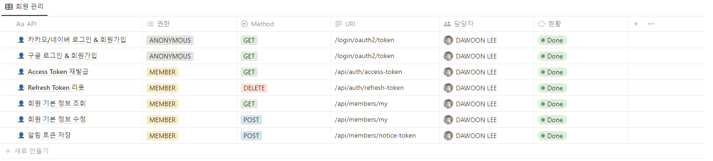
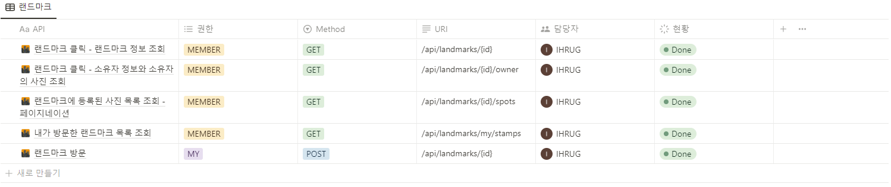
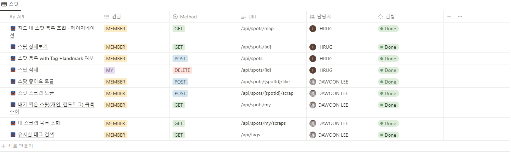
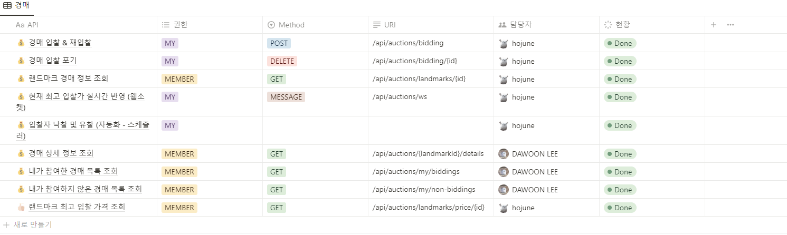
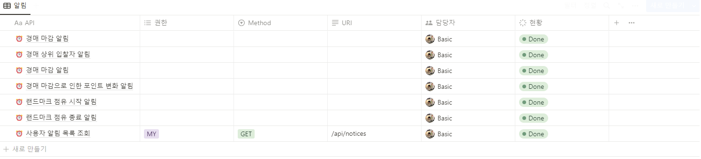
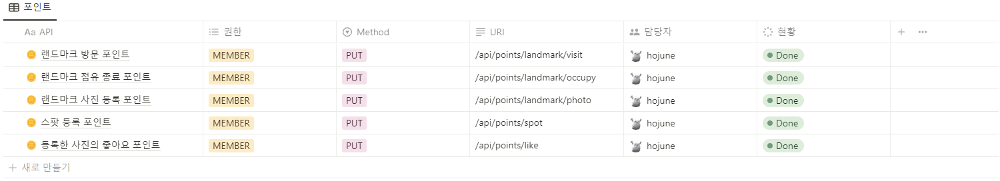

# :a: API 명세서

[링크](https://www.notion.so/7-API-b39044513414450d834d1d26f8f6f54b?pvs=4)

---

## :bust_in_silhouette: 회원 관리

---

---

## :earth_asia: 지도 기반 클러스터링

---

---

## :city_sunrise: 랜드마크

---

---

## :camera: 스팟

---

---

## :moneybag: 경매

---

---

## :alarm_clock: 알림

---

---

## :credit_card: 포인트

